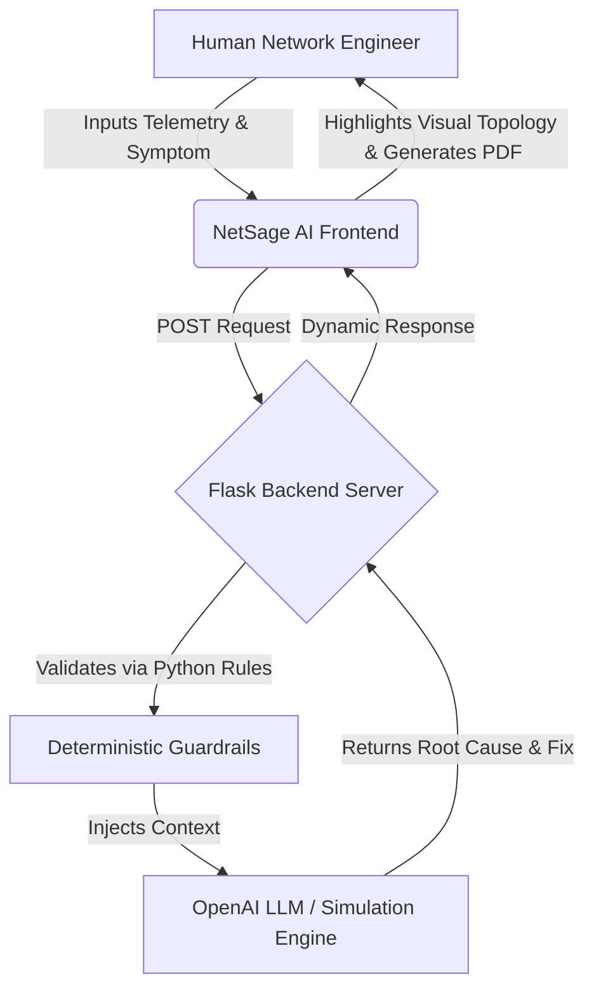

<div align="center">

# NetSage AI - Advanced Diagnostic Engine
**Cisco AI Internship Final Project**


**Live Project URL:** [https://netsage-ai-ij6m.onrender.com](https://netsage-ai-ij6m.onrender.com)

</div>

---

## 📌 Project Overview
NetSage AI is an enterprise-grade, AI-assisted network troubleshooting application designed to bridge the gap between complex network telemetry and rapid incident resolution. Built during the Cisco AI Internship, it uses Generative AI combined with deterministic Python guardrails to analyze raw Cisco CLI outputs, diagnose network faults, and provide human-in-the-loop (HITL) fix recommendations.

## 🛠 Internship Tasks Accomplished
1. **Identified AI Use Case:** Automated Network Troubleshooting.
2. **LLM Prompt Engineering:** Designed complex prompts to force the AI to act as a deterministic Cisco CCIE engineer (`diagnose_prompt.md`).
3. **Responsible AI & Guardrails:** Built `rule_checker.py` to fact-check AI outputs, preventing hallucinations in network fixes.
4. **Dataset Creation:** Built `cases.csv` to map network symptoms to root causes and OSI layers.
5. **Full-Stack Deployment:** Built a premium Glassmorphism UI with interactive topology maps, and deployed the Flask backend live to Render.

---

## ⚙️ Architecture Flow Diagram



---

## 📁 Folder Architecture

```text
NetSage-AI/
├── app.py                     # Main Flask Backend Server
├── index.html                 # Premium Glassmorphism Web Dashboard
├── rule_checker.py            # Python Guardrails to prevent AI hallucinations
├── diagnose_prompt.md         # Engineered System Prompt for the LLM
├── requirements.txt           # Deployment Dependencies (Flask, gunicorn)
├── prepare_submission.py      # Automated script for college folder submission
├── Final_Submission_Ready/    # Formatted folders for TPO Evaluation
│   ├── Dataset/
│   ├── Evidence files/
│   ├── Human Reviewer/
│   ├── Python files - tools/
│   └── Other project-related files/
```

---

## 🚀 Beginner's Guide: How to Use This Project

If you are new to networking or AI, follow this simple guide to see how the magic works!

1. Open the Live URL: [https://netsage-ai-ij6m.onrender.com](https://netsage-ai-ij6m.onrender.com)
2. On the **Login Screen**, type any name (e.g., "Admin") and hit Enter.
3. On the **Sidebar (Left)**, click on the **"Diagnostics"** tab.
4. Under **"Support Ticket Data"**, use the dropdown menu to select a broken network scenario (e.g., *INC-1042: PC in VLAN 30 cannot reach server*).
5. You will see the CLI Telemetry (the raw code the router outputs) automatically populate.
6. Click the glowing **Synthesize Diagnosis** button.
7. **Watch the Magic:** 
   - The interactive visual network map will **flash red** to show you exactly where the physical connection is broken.
   - The AI Analysis Engine will spit out the Root Cause, the OSI Layer, and the exact commands to fix the router.
   - Click **Export PDF Incident Report** to generate a professional support ticket!
8. Click **Modify & Commit** to see how the system logs human interventions dynamically in the **Review Logs** tab!

---

## 🔑 OpenAI API Key (Live Mode)

By default, the application runs in **Simulation Mode** (meaning it uses built-in smart logic to diagnose the provided tickets instantly without needing to pay for AI). 

However, this project is fully integrated with **Live OpenAI Models**. 
- **What is an API Key?** It is a secure password that allows this application to securely talk to ChatGPT's brain in real-time.
- **How to use it:** If you have an OpenAI account with credits, generate an API key at `platform.openai.com`. Paste that key into the top-right box on the NetSage dashboard. The app will immediately switch from Simulation Mode to Live AI Mode and send the telemetry to a real neural network!

---

## 💻 How to Run Locally (For Developers)

If you want to run the code on your own machine instead of the live link:

1. Clone this repository.
2. Ensure you have Python installed.
3. Open a terminal in the folder and install requirements:
   ```bash
   pip install -r requirements.txt
   ```
4. Start the backend server:
   ```bash
   python app.py
   ```
5. Open your web browser and navigate to `http://localhost:5000`.

---

<div align="center">
  <h3>Built by Krishna Dubey</h3>
  <p>Cisco AI Virtual Internship</p>
</div>
